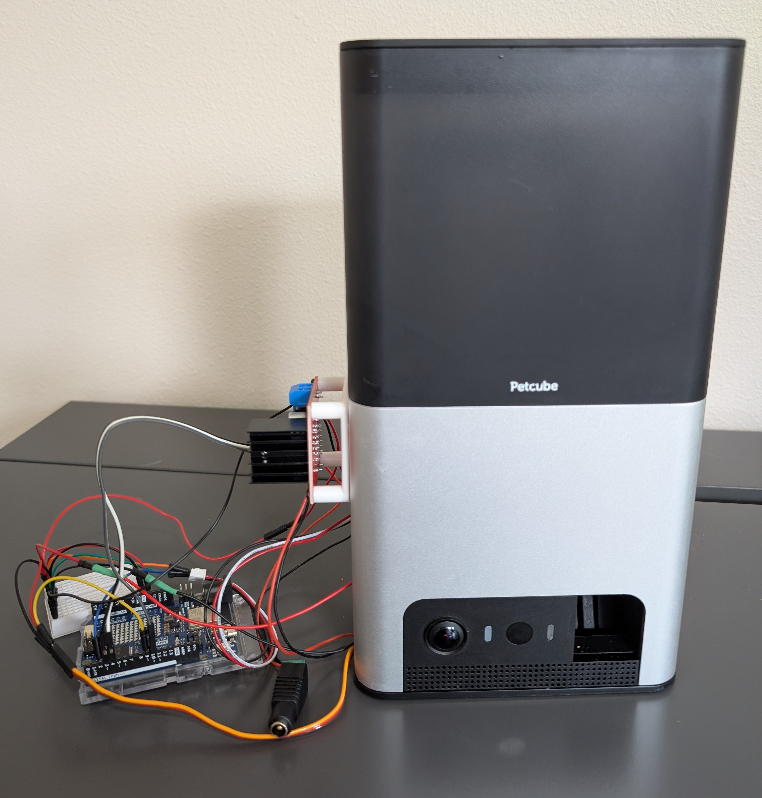
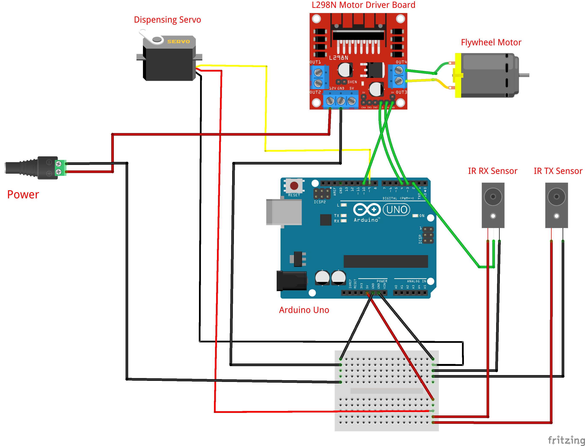

# Interactive Pet Food Dispenser

An Arduino-powered retrofit of a broken pet food dispenser that can be triggered from a live streaming chat. The original dispenser mechanism was modified by replacing one of the motors with a servo-driven loader, adding a break beam sensor to detect when food is ready to be dispensed, and using a flywheel motor to launch the food.

## Project Goal

The goal of this project was to take a broken pet food dispenser and rebuild it into a chat-controlled interactive device for live streams. Viewer commands are handled by a broadcast automation tool, such as Streamer.bot or Mix It Up, which triggers a Python script that sends a serial command to an Arduino. The Arduino loads food using a servo, waits for a break beam sensor to confirm that food is ready, and then runs the flywheel motor to dispense it.

## How It Works

1. A viewer redeems a channel redemption in the live stream chat.
2. A broadcast automation tool recognizes the channel redemption and triggers the python control script.
4. The Python script opens a serial connection to the Arduino and sends the `DISPENSE` command.
5. The Arduino receives the command and starts the dispense sequence.
6. The servo moves back and forth to load food into position.
7. The break beam sensor detects when food interrupts the beam, confirming that food is ready to dispense.
8. Once food is detected, the flywheel motor runs for a set duration to dispense the food.

## Hardware Used

- Arduino Uno
- L298N motor driver board
- DC flywheel motor
- Servo motor
- IR break beam sensor
  - IR transmitter
  - IR receiver
- External power supply
- Breadboard and jumper wires
- Pet food dispenser
- Custom 3D printer parts to integrate new parts with existing parts

## Wiring Diagram

## Future Improvements

- Replace the breadboard wiring with soldered connections or a protoboard for a more permanent setup.
